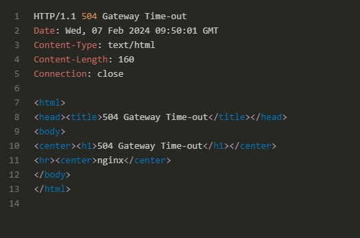

# Database Pool Full: Analogy


Imagine a pool of cars (database connections). You borrow one (open a connection), use it, but forget to return it (close it).    
Eventually, everyone wants a car (connection), but there are none left (pool is full), leading to a traffic jam (504 error).

Bad practice: `/api/avg-bad` borrows a car but never returns it.  
Good practice: `/api/avg-good` borrows a car, uses it, and then returns it promptly.

SpringBootJPAHikariCP - Timeout failure stats (total=20, active=20, idle=0, waiting=46) <-- **Cause of http 504 gateway timeout**

  



https://drive.google.com/file/d/17qRYtRWhUHWYF84HZcnBHSANUtI7wDJ1/view?usp=sharing

# Install ingress controller (Docker Desktop)
```Shell
helm upgrade --install ingress-nginx ingress-nginx \
  --repo https://kubernetes.github.io/ingress-nginx \
  --namespace ingress-nginx --create-namespace
```

# Install ingress controller (Minikube)
```Shell
minikube start  
minikube addons enble ingress  
minikube addons list 
|ingress| minikube | enabled ✅| Kubernetes|
minikube tunnel  
```

```Shell
$ k get ns
NAME              STATUS   AGE
default           Active   71m
ingress-nginx     Active   46s
kube-node-lease   Active   71m
kube-public       Active   71m
kube-system       Active   71m
```

# Java
```Shell
mvn package -Dmaven.test.skip=true 
docker build -t taaesan/app-db-leak:latest . 
docker push taaesan/app-db-leak:latest
```

# K8S build
```Shell  
k apply -f k8s/mysql-secret.yaml
k apply -f k8s/mysql-storage.yaml
k apply -f k8s/mysql-deployment.yaml
k apply -f k8s/app-db-leak-deployment.yaml
k apply -f k8s/ingress.yaml
```
## kubernetes mysql
https://phoenixnap.com/kb/kubernetes-mysql

## Setup Ingress NGINX
https://github.com/kubernetes/ingress-nginx

## Detecting a connection leak
https://www.naiyerasif.com/post/2022/09/18/detecting-a-connection-leak-with-hikari/
